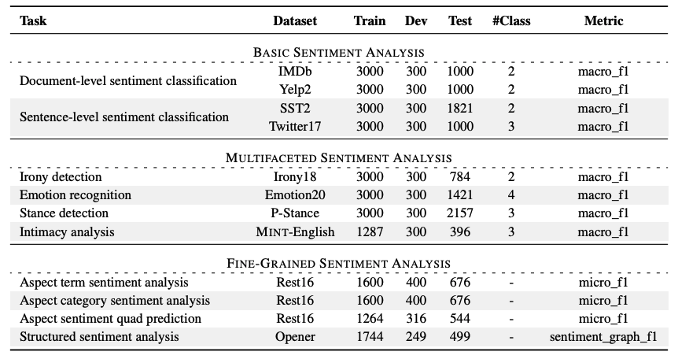

# Targeted Distillation for Sentiment Analysis

This repository contains the official datasets, and evaluation scripts for the paper:

**Targeted Distillation for Sentiment Analysis**
*Yice Zhang, Guangyu Xie, Jingjie Lin, Jianzhu Bao, Qianlong Wang, Xi Zeng, Ruifeng Xu (2025)*[[arXiv]](https://arxiv.org/abs/2503.03225)

Our work introduces a **targeted distillation framework** designed to transfer sentiment-related capabilities from advanced LLMs into compact language models. The project also provides **SentiBench**, a comprehensive benchmark for evaluating sentiment-analysis performance across diverse task types.

---

## 🚀 Abstract

This paper explores targeted distillation methods for sentiment analysis, aiming to build compact and practical models that preserve strong and generalizable sentiment analysis capabilities. To this end, we conceptually decouple the distillation target into knowledge and alignment and accordingly propose a two-stage distillation framework. Moreover, we introduce SentiBench, a comprehensive and systematic sentiment analysis benchmark that covers a diverse set of tasks across 12 datasets. We evaluate a wide range of models on this benchmark. Experimental results show that our approach substantially enhances the performance of compact models across diverse sentiment analysis tasks, and the resulting models demonstrate strong generalization to unseen tasks, showcasing robust competitiveness against existing small-scale models.


## 📊 SentiBench Benchmark

We introduce **SentiBench**, a sentiment analysis benchmark covering:

* **3 Task Categories**
* **12 Datasets**
* Including basic sentiment analysis, multifaceted sentiment analysis, and fine-grained sentiment analysis.



---

## 📁 Project Structure

```
.
├── bash/                         # Evaluation scripts
│   ├── fsa.sh
│   ├── multifaced.sh
│   ├── multi_task_fsa.sh
│   └── multi_task_multifaced.sh
├── datasets/                     # SentiBench datasets
│   ├── absa/                     # Fine-grained sentiment analysis (FSA)
│   ├── multifaced/               # Multi-faceted sentiment analysis (MSA)
│   └── sc/                       # Basic sentiment analysis (BSA)
├── fsa.py                        # FSA evaluation entry
├── icl_multifaced.py             # MFSA evaluation entry
├── model_name.json               # Model version-to-path mapping
├── model_weights/                # Downloaded distilled models
│   ├── llama-3-1B-sentiment-distillation-v1
│   ├── llama-3-3B-sentiment-distillation-v1
│   └── Qwen2.5-1.5B-sentiment-distillation-v1
├── output/
│   └── result.txt                # Final results
├── parse.py                      # Result parser
├── parse_utils/                  # Parsing utilities for different tasks
│   ├── acsa.py
│   ├── asqp.py
│   ├── atsa.py
│   ├── coqe.py
│   ├── multifaced.py
│   └── ssa.py
├── utils.py
└── README.md
```

---


## **Training Corpus**

Our targeted distillation corpus: [https://huggingface.co/datasets/zhang-yice/sentiment-distillation-v1](https://huggingface.co/datasets/zhang-yice/sentiment-distillation-v1)

### **Released Distilled Models**

| Model                                  | Base Model   | HuggingFace                                                                                                                                          |
| -------------------------------------- | ------------ | ---------------------------------------------------------------------------------------------------------------------------------------------------- |
| llama-3-1B-sentiment-distillation-v1   | Llama-3-1B-Instruct   | [https://huggingface.co/zhang-yice/llama-3-1B-sentiment-distillation-v1](https://huggingface.co/zhang-yice/llama-3-1B-sentiment-distillation-v1)     |
| Qwen2.5-1.5B-sentiment-distillation-v1 | Qwen2.5-1.5B-Instruct | [https://huggingface.co/zhang-yice/Qwen2.5-1.5B-sentiment-distillation-v1](https://huggingface.co/zhang-yice/Qwen2.5-1.5B-sentiment-distillation-v1) |
| llama-3-3B-sentiment-distillation-v1   | Llama-3-3B-Instruct   | [https://huggingface.co/zhang-yice/llama-3-3B-sentiment-distillation-v1](https://huggingface.co/zhang-yice/llama-3-3B-sentiment-distillation-v1)     |

Download the corresponding model and place it into:

```
./model_weights/{model_name}
```

---

## 🧪 Evaluation

### 1️⃣ Download distilled models

Download the distilled model from huggingface and place each model under:

```
model_weights/
    ├── Qwen2.5-1.5B-sentiment-distillation-v1/
    ├── llama-3-1B-sentiment-distillation-v1/
    └── llama-3-3B-sentiment-distillation-v1/
```

Ensure `model_name.json` correctly maps the model version to its path.

---

### 2️⃣ Run Evaluation on SentiBench

#### **Qwen2.5-1.5B-sentiment-distillation-v1**

```bash
# Fine-grained Sentiment Analysis (FSA) 
bash/multi_task_fsa.sh -c 0 -b Qwen2.5-1.5B-sentiment-distillation-v1 -v Qwen2.5-1.5B-sentiment-distillation-v1 -z 16

# Multi-faceted Sentiment (MSA) + Basic Sentiment Analysis (BSA)
bash/multi_task_multifaced.sh -c 1 -b Qwen2.5-1.5B-sentiment-distillation-v1 -v Qwen2.5-1.5B-sentiment-distillation-v1
```

#### **llama-3-1B-sentiment-distillation-v1**

```bash
bash/multi_task_fsa.sh -c 0 -b llama-3-1B-sentiment-distillation-v1 -v llama-3-1B-sentiment-distillation-v1 -z 16
bash/multi_task_multifaced.sh -c 1 -b llama-3-1B-sentiment-distillation-v1 -v llama-3-1B-sentiment-distillation-v1
```

#### **llama-3-3B-sentiment-distillation-v1**

```bash
bash/multi_task_fsa.sh -c 0 -b llama-3-3B-sentiment-distillation-v1 -v llama-3-3B-sentiment-distillation-v1 -z 16
bash/multi_task_multifaced.sh -c 1 -b llama-3-3B-sentiment-distillation-v1 -v llama-3-3B-sentiment-distillation-v1
```

---

### 3️⃣ Parse Evaluation Results

```bash
python parse.py
```

Detailed results will appear in:

```
output/result.txt
```

---

## 📄 Citation

If you use our code, datasets, or models, please cite:

```bibtex
@inproceedings{zhang-etal-2025-targeted,
    title = "Targeted Distillation for Sentiment Analysis",
    author = "Zhang, Yice  and
      Xie, Guangyu  and
      Lin, Jingjie  and
      Bao, Jianzhu  and
      Wang, Qianlong  and
      Zeng, Xi  and
      Xu, Ruifeng",
    editor = "Christodoulopoulos, Christos  and
      Chakraborty, Tanmoy  and
      Rose, Carolyn  and
      Peng, Violet",
    booktitle = "Proceedings of the 2025 Conference on Empirical Methods in Natural Language Processing",
    month = nov,
    year = "2025",
    address = "Suzhou, China",
    publisher = "Association for Computational Linguistics",
    url = "https://aclanthology.org/2025.emnlp-main.1127/",
    doi = "10.18653/v1/2025.emnlp-main.1127",
    pages = "22169--22192",
    ISBN = "979-8-89176-332-6",
}
```